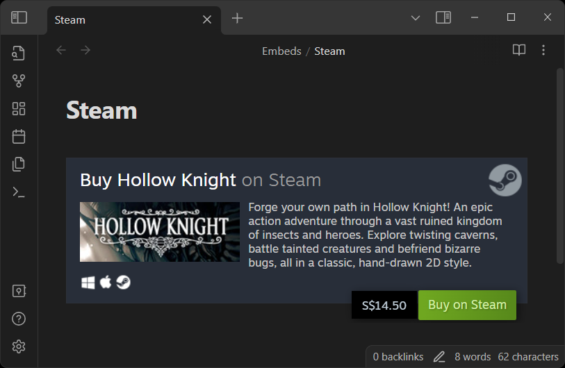
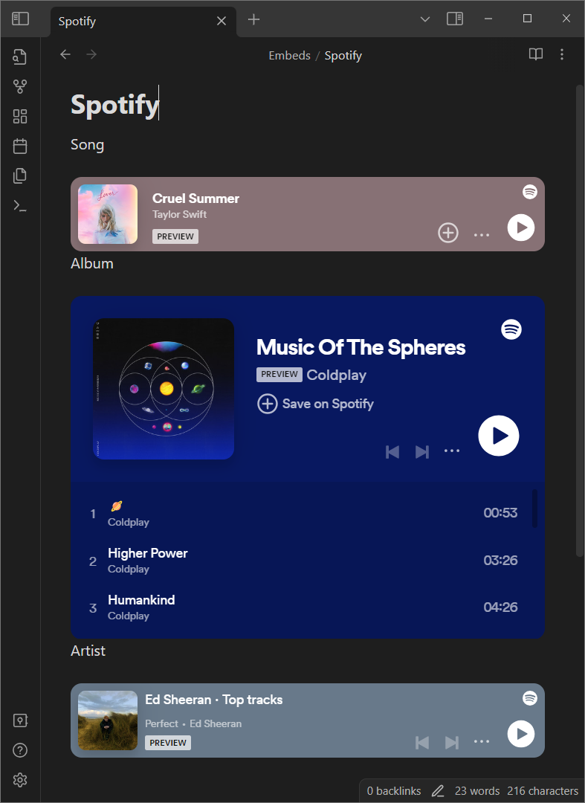

# obsidian-auto-embed
[Obsidian](https://obsidian.md/) plugin to help embed links automatically instead of using iframes

## Supported website list
This is a list of supported websites with some examples.Websites with a `*` means it has some limitation. See [Current Limitations & Known Bugs](README.md/#current-limitations--known-bugs) for more info

| Website | Example | Markdown |
|---|---|---|
|[X](https://x.com) *||``|
|[Reddit](https://www.reddit.com/) *||``|
|[Imgur](https://imgur.com/)||``|
|[CodePen](https://codepen.io/)||``|
|[Steam](https://store.steampowered.com/)||``|
|[Spotify](https://open.spotify.com/) *||``|